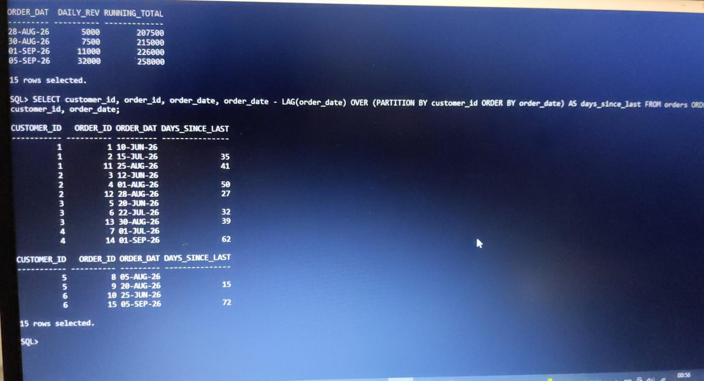
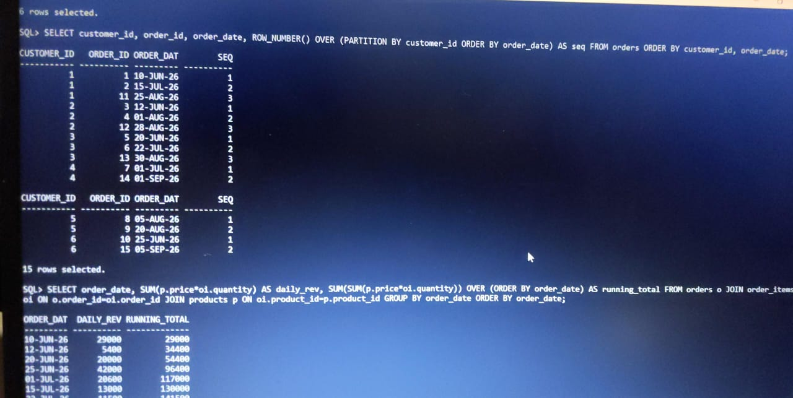
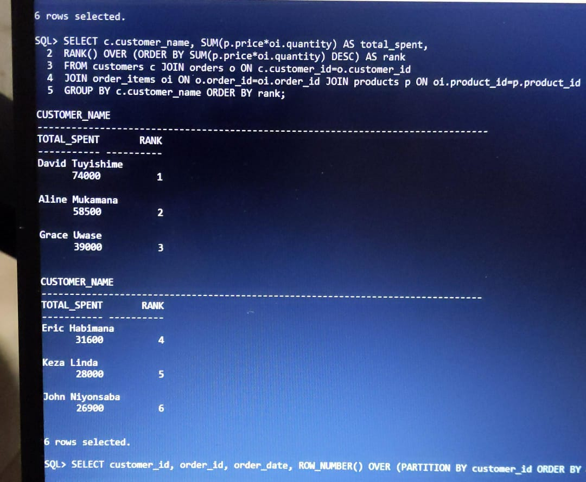
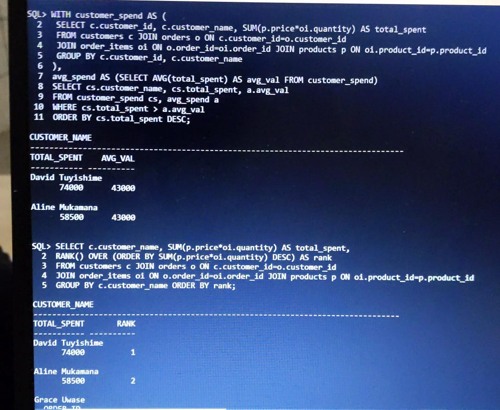
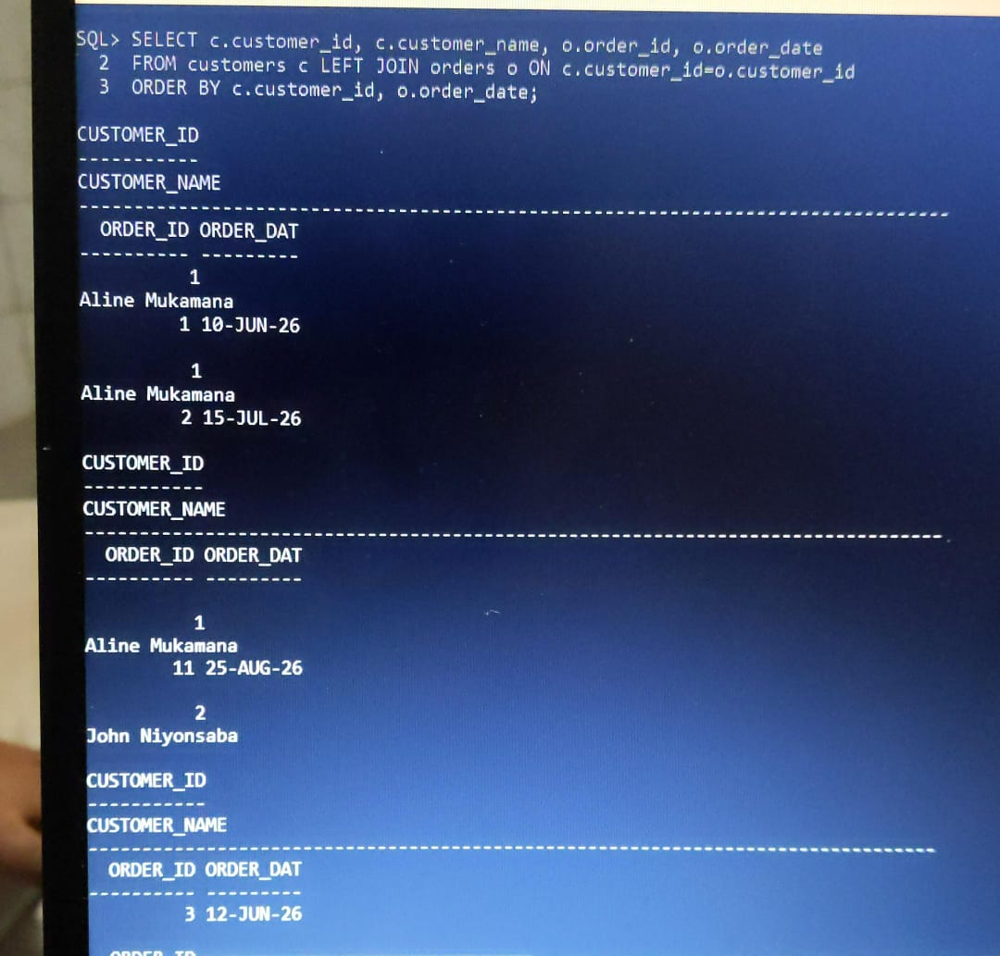
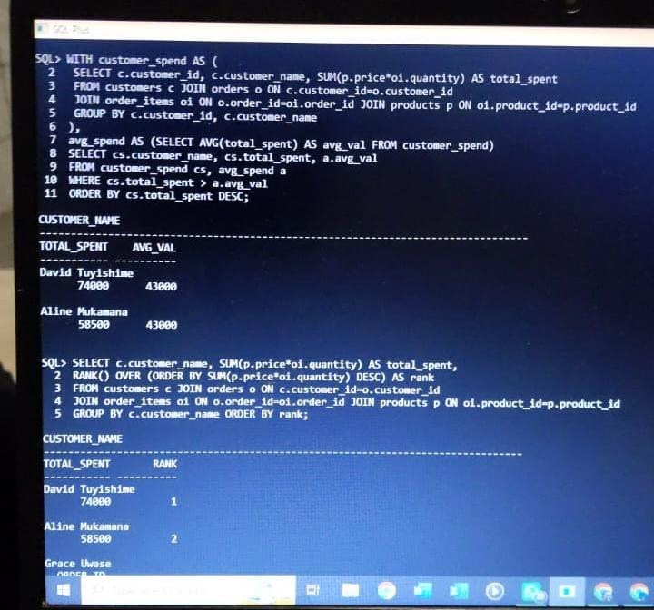
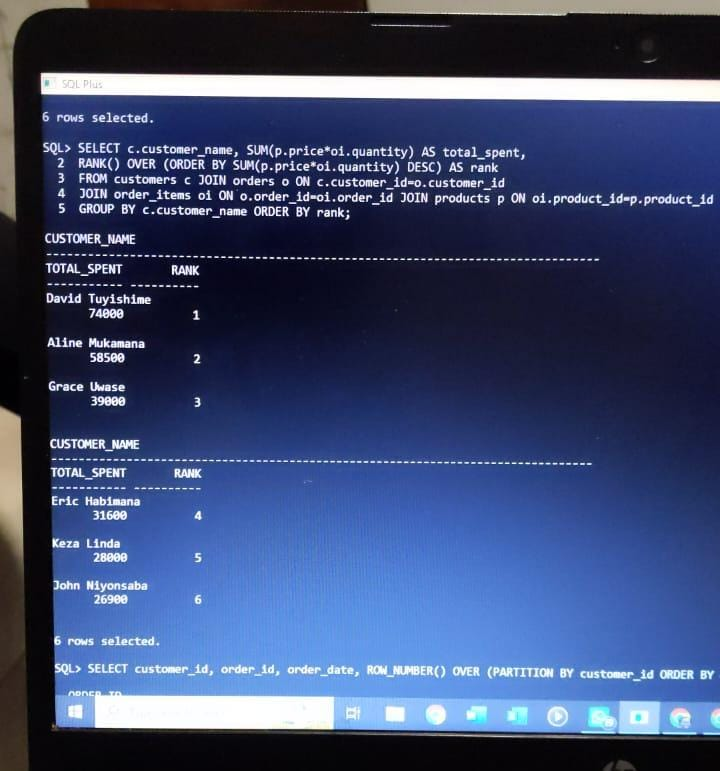

# PLSQL Assignment One - Sunrise Supermarket
**Student:** Mulisa Sharon
**Student ID:** 20251IMA030
**Group:** B/C/I - Due Sep 21, 2026
**DBMS Used:** Oracle Database 21c Express Edition (PDB: ORCLPDB, Schema: SUNRISE)
**GitHub:** assignment_1_Mulisa_Sharon-20251IMA030

## 1. Business Scenario
Sunrise Supermarket in Kigali needs to analyze sales performance. The database tracks customers, products, orders, and order items to answer: Who are top customers? What products sell? How is revenue growing over time?

ER Design:
- customers (customer_id PK) - 6 records
- products (product_id PK) - 6 records  
- orders (order_id PK, customer_id FK) - 15 orders
- order_items (order_item_id PK, order_id FK, product_id FK) - 28 line items

Relationship: One Customer -> Many Orders -> Many Order_Items, Products -> Order_Items

## 2. How to Run
```sql
-- Connect as SYSDBA
sqlplus / as sysdba
ALTER SESSION SET CONTAINER=ORCLPDB;
ALTER SESSION SET CURRENT_SCHEMA=sunrise;

-- Or run script
@sunrise_full_script.sql

-- Verify
SELECT COUNT(*) FROM customers; -- 6
SELECT COUNT(*) FROM order_items; -- 28
## Screenshots

### Q1 INNER JOIN


### Q2 Multi-JOIN


### Q3 LEFT JOIN


### Q4 CTE


### Q5 RANK()


### Q6 ROW_NUMBER()


### Q7 Running Total


### Q8 LAG()


